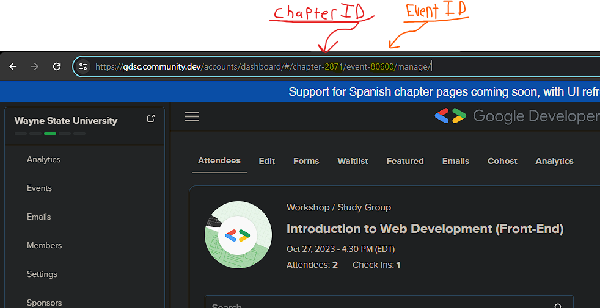
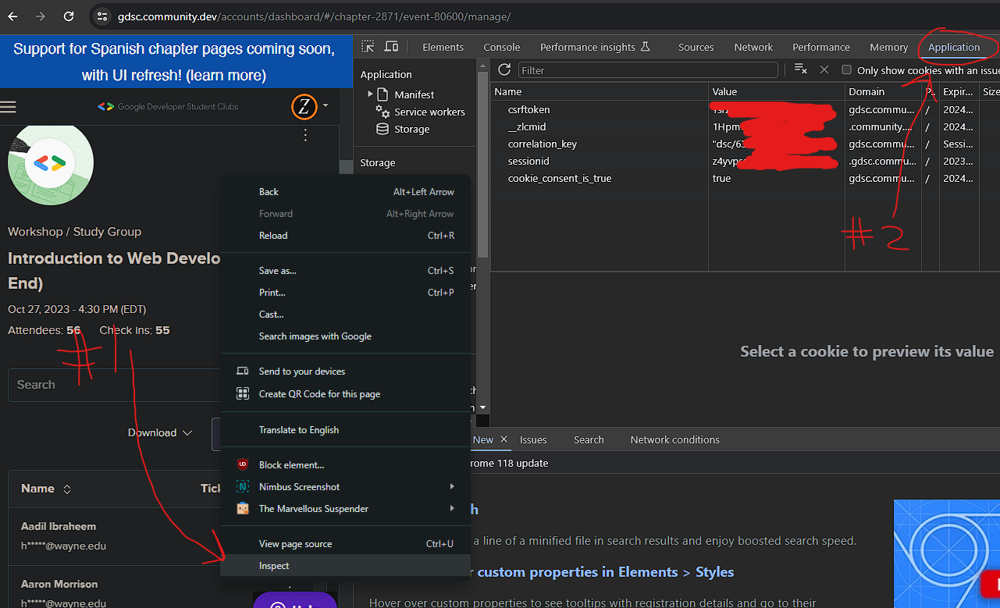

# Automate adding attendees to gdsc.community.dev dashboard

## What you need

* [Python](https://www.python.org/downloads/) (v3.5+)
* Event ID
* Chapter ID
  * 
* Cookie-based [auth](#setup) profile

## Setup
  * 
  * Right click and hit `Inspect`, then go to the `Application` tab
  * Copy and paste all those values in the renamed file `config.example.json` -> `config.json`:
    ```json
    {
        "event_id": "80600",
        "chapter_id": "2871",
        "cookie": {
            "csrftoken": "your_csrf_token",
            "__zlcmid": "your_zendesk_cookie",
            "correlation_key": "\"your_correlation_cookie\"",
            "sessionid": "your_session_id",
            "cookie_consent_is_true": "true"
        }
    }
    ```
  * In `attendees.txt` add your attendees in the following csv format: 
    ```csv
    first_name,last_name,example@example.com
    ```
    with each line being a new person.


## Running

* Make sure Python is installed.
* To run the script **after** you set it up, run `py add_attendee.py` in your terminal (or just right click and run w/ python)


its not the best solution, so if you have any improvements, throw a pr out!